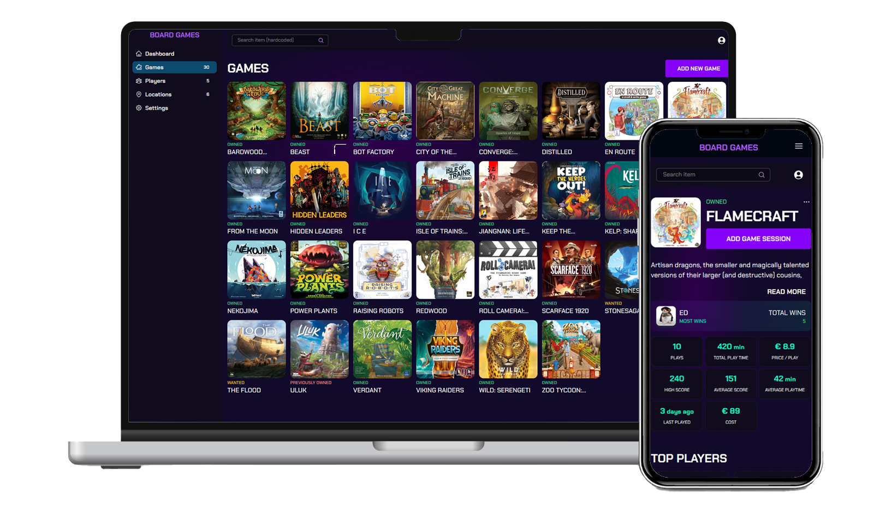
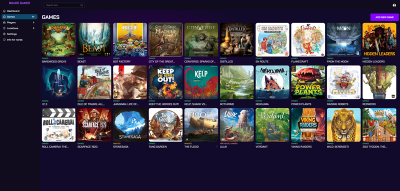
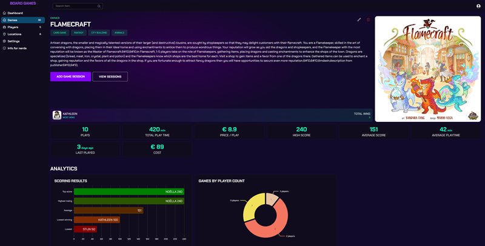
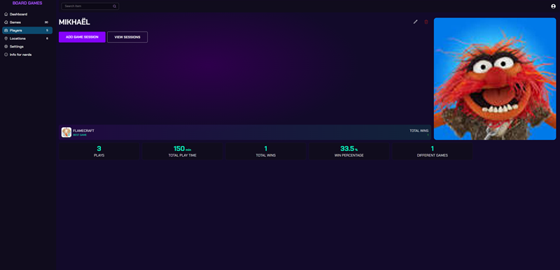
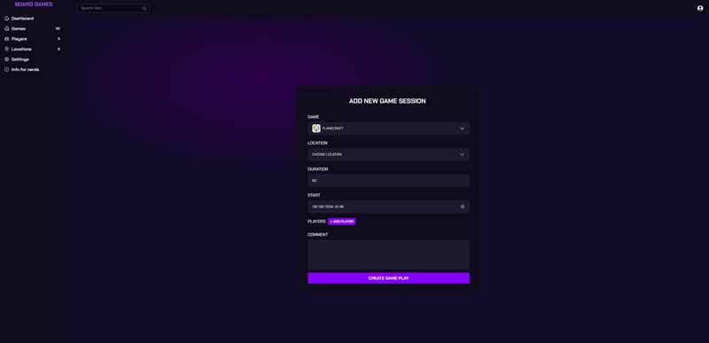

# BoardGameTracker

<p align="center">
  
  <br/>
  <br/>
  
BoardGameTracker is a self-hosted board game statistics tracker that can be run in a Docker container. This app is ideal for those who want to track how much they've spent on their collection, identify their best game, and find out which of their friends consistently wins.
<br/>
<br/>
⚠️ The project is still unstable. Lots of (breaking) changes can happen.
</p>


## Roadmap
| Feature                                 | Status |
|-----------------------------------------|-------:|
| Import game from BGG                    | ✅    |
| User & Game list                        | ✅    |
| See game details and simple statistics  | ✅    |
| See dashboard statistics                | 🚧    |
| Proper logging                          | 🚧    |
| Implemented settings page               | 🚧    |
| Add translations                        | 🚧    |
| Add game manually                       |        |
| View player VS player statistics        |        |
| Add more graphs to game details         |        |
| Add statistics to user details          |        |
| View game session details               |        |

✅: Done (for now) / 🚧: Working on it at the moment

## Setup
### Docker command
```
docker run \
  --name=boardgametracker \
  --restart unless-stopped \
  -e DB_HOST=<DB_HOST> \
  -e DB_USER=<DB_USER> \
  -e DB_PASSWORD=<DB_PASSWORD> \
  -e DB_NAME=<DB_NAME> \
  -e DB_PORT=<DB_PORT> \
  -e STATISTICS=0 \
  -p <HOST_PORT>:5444 \
  -v /path/to/images/data:/app/images \
  -v /path/to/data:/app/data \
  uping/boardgametracker
```

### Docker compose (recommended)
```
version: "3.8"
services:
  boardgametracker:
    image: uping/boardgametracker:latest
    restart: unless-stopped
    volumes:
      - <IMAGE_PATH>:/app/images
      - <DATA_PATH>:/app/data
    ports:
      - 5444:5444
    environment:
      - DB_HOST=db
      - DB_USER=dev
      - DB_PASSWORD=CHANGEME
      - DB_NAME=boardgametracker
      - DB_PORT=5432
      - STATISTICS=0
  db:
    image: postgres:16
    restart: unless-stopped
    volumes:
      - <DB_PATH>:/var/lib/postgresql/data
    environment:
      - POSTGRES_DB=boardgametracker
      - POSTGRES_USER=dev
      - POSTGRES_PASSWORD=CHANGEME
    ports:
      - 5432:5432
```

You can also download the docker compose example [here](docker-compose.yml)

### Environment settings
| Name              | Default          | Comment |
|-------------------|------------------|---------|
| DB_HOST           | *None*           | Postgress hostname |
| DB_PORT           | 5432             | Postgress port |
| DB_USER           | *None*           | Postgress username |
| DB_PASSWORD       | *None*           | Postgress password |
| DB_NAME           | boardgametracker | Postgress database name |
| STATISTICS        | 0                | Enable/Disable Sentry debug logging (no private data is logged) |
| DATE_FORMAT       | yy-MM-dd         | Date format (use [date-fns](https://date-fns.org/v3.6.0/docs/format) formatting) |
| TIME_FORMAT       | HH:mm            | Time format (use [date-fns](https://date-fns.org/v3.6.0/docs/format) |
| TZ                | Europe/Londen    | Timezone |
| DECIMAL_SEPARATOR | ,                |  |
| CURRENCY          | €                |  |

## Screenshots









# Tooling
- This project is tested with BrowserStack.
- Translations are managed with Crowdin
