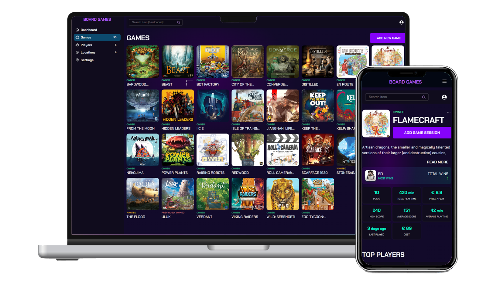
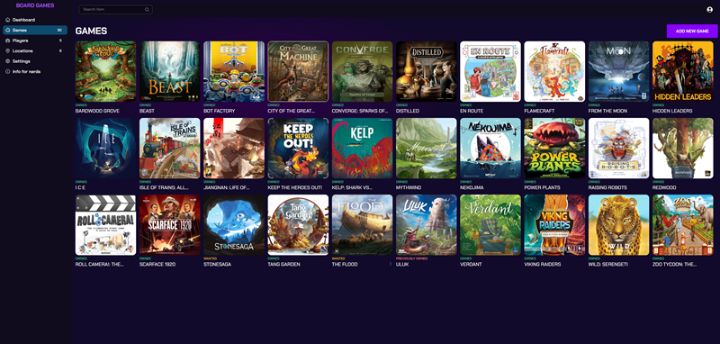
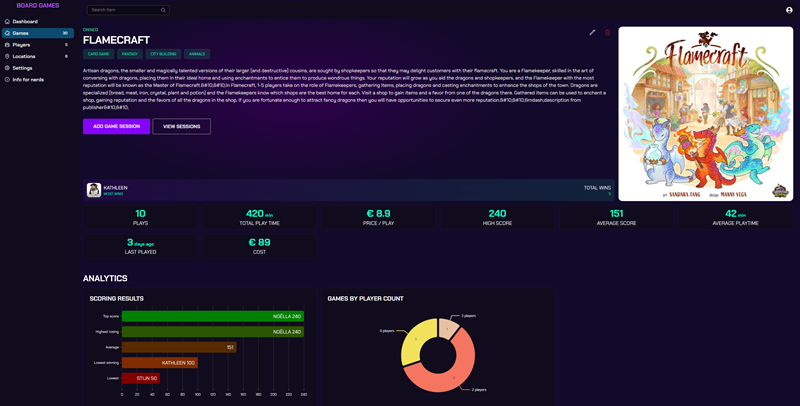
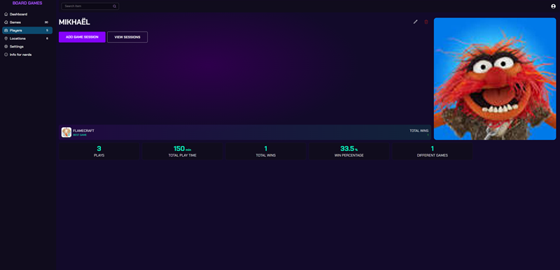
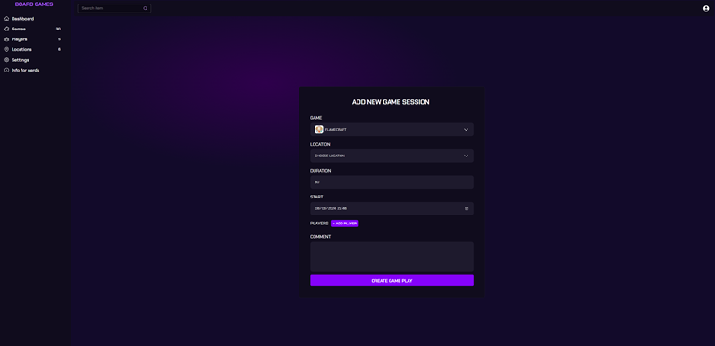

# BoardGameTracker

<p align="center">
  
</p>

<p align="center">
  <strong>A self-hosted board game statistics tracker for analyzing your collection and gaming sessions</strong>
</p>

<p align="center">
  <a href="https://github.com/mregni/BoardGameTracker/releases">
    
  </a>
  <a href="https://github.com/mregni/BoardGameTracker/actions/workflows/publish-container.yml">
    
  </a>
  <a href="https://github.com/mregni/BoardGameTracker/actions/workflows/security.yml">
    
  </a>
  <a href="https://sonarcloud.io/summary/new_code?id=mregni_BoardGameTracker">
    
  </a>
  <a href="https://sonarcloud.io/component_measures?id=mregni_BoardGameTracker&metric=security_review_rating&view=list">
    
  </a>
  <a href="https://sonarcloud.io/summary/new_code?id=mregni_BoardGameTracker">
    
  </a>
  <a href="https://hub.docker.com/r/uping/boardgametracker">
    
  </a>
  <a href="https://hub.docker.com/r/uping/boardgametracker">
    
  </a>
  <a href="https://github.com/mregni/BoardGameTracker/blob/master/LICENSE">
    
  </a>
</p>

---

## Overview

BoardGameTracker is a self-hosted application designed for board game enthusiasts who want to:
- Track spending on their collection
- Analyze game statistics and identify favorites
- Monitor player performance and win rates
- Visualize gaming trends over time

**BoardGameGeek (BGG) integration** works with a personal BGG API key: request one at [boardgamegeek.com/applications](https://boardgamegeek.com/applications) and paste it under *Settings → BoardGameGeek* (or set `BGG_API_KEY`). It unlocks single-game import, collection import and expansion lookup.

> ⚠️ **Note**: This project is under active development. Breaking changes may occur between releases.

---

## Installation

### Prerequisites
- Docker installed on your system
- PostgreSQL database (can be run via Docker Compose)

### Quick Start with Docker Compose (Recommended)

1. Download the [docker-compose.yml](docker-compose.yml) file (it also contains the optional rules assistant) or create a minimal one with the following content:

```yaml
services:
  boardgametracker:
    image: uping/boardgametracker:latest
    restart: unless-stopped
    depends_on:
      db:
        condition: service_healthy
    volumes:
      - ./images:/app/images
      - ./logs:/app/logs
      - ./manuals:/app/manuals
    ports:
      - "5444:5444"
    environment:
      - DB_HOST=db
      - DB_USER=dbuser
      - DB_PASSWORD=CHANGEME
      - DB_NAME=boardgametracker
      - DB_PORT=5432
      - JWT_SECRET=CHANGEME_GENERATE_AT_LEAST_32_CHARACTERS
      - TZ=UTC
    healthcheck:
      test: ["CMD", "curl", "-f", "http://localhost:5444/api/health"]
      interval: 30s
      timeout: 5s
      retries: 3
      start_period: 10s

  db:
    image: pgvector/pgvector:pg16
    restart: unless-stopped
    volumes:
      - ./postgres-data:/var/lib/postgresql/data
    environment:
      - POSTGRES_DB=boardgametracker
      - POSTGRES_USER=dbuser
      - POSTGRES_PASSWORD=CHANGEME
    healthcheck:
      test: ["CMD-SHELL", "pg_isready -U dbuser -d boardgametracker"]
      interval: 10s
      timeout: 5s
      retries: 5
      start_period: 10s

```

> The database image must provide the `vector` extension (`pgvector/pgvector:pg16` does; plain `postgres:16` does not). The application refuses to start against a server without it.

2. Update the placeholder values:
   - Change the `CHANGEME` passwords to secure values
   - Set `JWT_SECRET` to a random value of at least 32 characters (for example `openssl rand -base64 48`). It is required unless you run with `AUTH_ENABLED=false`
   - Adjust the timezone (`TZ`) to your location

3. Start the containers:
```bash
docker compose up -d
```

4. Access the application at `http://localhost:5444` and log in with `admin` / `admin` (or the `ADMIN_PASSWORD` you set). Change the password after the first login.

### Docker Run Command

If you prefer using Docker CLI or have an existing PostgreSQL instance (with the `vector` extension installed):

```bash
docker run -d \
  --name boardgametracker \
  --restart unless-stopped \
  -e DB_HOST=<DB_HOST> \
  -e DB_USER=dbuser \
  -e DB_PASSWORD=CHANGEME \
  -e DB_NAME=boardgametracker \
  -e DB_PORT=5432 \
  -e JWT_SECRET=CHANGEME_GENERATE_AT_LEAST_32_CHARACTERS \
  -e TZ=UTC \
  -p 5444:5444 \
  -v ./images:/app/images \
  -v ./logs:/app/logs \
  -v ./manuals:/app/manuals \
  uping/boardgametracker:latest
```

---

## Configuration

### Environment Variables

| Variable          | Default            | Required | Description |
|-------------------|--------------------|:--------:|-------------|
| `DB_HOST`         | -                  | ✅       | PostgreSQL hostname |
| `DB_PORT`         | `5432`             | ❌       | PostgreSQL port |
| `DB_USER`         | -                  | ✅       | PostgreSQL username |
| `DB_PASSWORD`     | -                  | ✅       | PostgreSQL password |
| `DB_NAME`         | `boardgametracker` | ❌       | PostgreSQL database name |
| `JWT_SECRET`      | -                  | ✅       | Signing key for login tokens, at least 32 characters. Not needed when `AUTH_ENABLED=false` |
| `AUTH_ENABLED`    | `true`             | ❌       | Set to `false` to run without login (anyone on the network gets full access) |
| `ADMIN_PASSWORD`  | `admin`            | ❌       | Password of the `admin` account when it is first created |
| `TZ`              | `UTC`              | ❌       | Timezone (e.g., `America/New_York`, `Asia/Tokyo`) |
| `STATISTICS_ENABLED` | `false`         | ❌       | Send anonymous error reports to Sentry |
| `PUID` / `PGID`   | `1654`             | ❌       | User and group that own the mounted `images`, `logs` and `manuals` folders |

Date format, time format, currency and language are set in the application under *Settings*. The full list, including email, reverse-proxy and rules-assistant settings, is in the [documentation](https://mregni.github.io/BoardGameTracker/getting-started/environment-variables/).

---

## Screenshots

<details>
<summary>Click to view screenshots</summary>

### Game Collection


### Game Details & Statistics


### Player Statistics


### Session Recording


</details>

---

## Technology Stack

### Backend
- .NET 10
- Entity Framework Core
- PostgreSQL
- Serilog for logging

### Frontend
- React 18
- TypeScript
- TanStack Router & Query
- Tailwind CSS
- Radix UI
- Vite

### Infrastructure
- Docker & Docker Compose
- GitHub Actions CI/CD
- SonarCloud code quality analysis

---

## Development

### Building from Source

1. Clone the repository:
```bash
git clone https://github.com/mregni/BoardGameTracker.git
cd BoardGameTracker
```

2. Run with Docker Compose:
```bash
docker compose -f docker-compose.build.yml up --build
```

### Running Tests

**Backend:**
```bash
dotnet test
```

**Frontend:**
```bash
cd boardgametracker.client
npm test
```

---

## Contributing

Contributions are welcome! Please feel free to submit a Pull Request.

1. Fork the repository
2. Create your feature branch (`git checkout -b feature/AmazingFeature`)
3. Commit your changes (`git commit -m 'Add some AmazingFeature'`)
4. Push to the branch (`git push origin feature/AmazingFeature`)
5. Open a Pull Request


---

## Support

If you encounter any issues or have questions:
- Open an [issue](https://github.com/mregni/BoardGameTracker/issues)
- Check existing [discussions](https://github.com/mregni/BoardGameTracker/discussions)

---

## Acknowledgments

- Tested with [BrowserStack](https://www.browserstack.com/)
- Translations managed with [Crowdin](https://crowdin.com/)
- Game data from [BoardGameGeek](https://boardgamegeek.com/)
