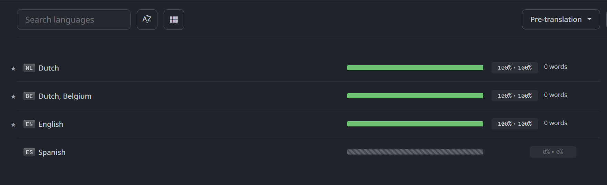

import { LinkButton } from '@astrojs/starlight/components';

BoardGameTracker supports multiple languages. You can help translate the application into your language with the help of the Crowdin tooling.

<LinkButton href="https://crowdin.com/project/boardgametracker" icon="external">
	Help translate on Crowdin
</LinkButton>

## How to contribute

Navigate to the Crowdin project for BoardGameTracker and follow the instructions to contribute translations. If your language is not yet listed, send me a message on Crowdin or create a feature request on GitHub and I'll add the new language as soon as possible.

